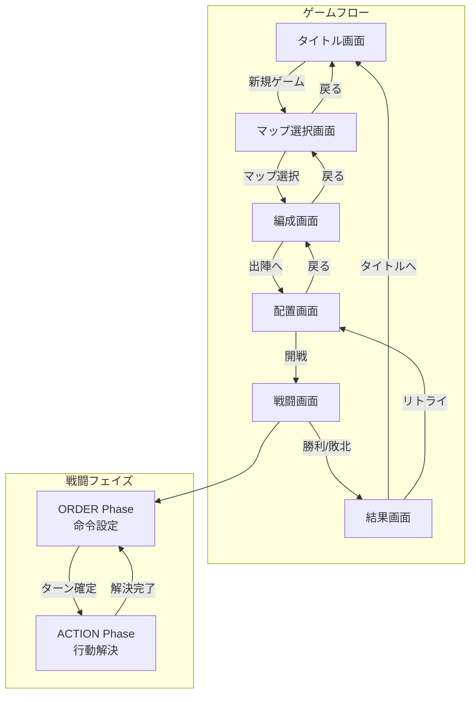

# Fantasy RTS - 包括的システム仕様書

**最終更新**: 2026-01-25  
**Version**: 1.0

---

## 1. プロジェクト概要

Fantasy RTSは、Three.jsベースのクォータービュー戦術RTSゲームです。
プレイヤーはユニットを編成し、ステージに配置して戦闘を行います。

### 1.1 主要機能
- **シーン管理**: タイトル → マップ選択 → 編成 → 配置 → 戦闘 → 結果
- **ユニット管理**: 複数ユニットタイプ、陣形システム
- **マップシステム**: 高低差のあるクォータービュー地形
- **建造物システム**: ボクセルベースの建物配置
- **2フェイズ戦闘**: ORDER（命令設定）→ ACTION（行動解決）

---

## 2. ディレクトリ構成

```
fantasyrts/
├── index.html              # メインエントリーポイント
├── scripts/                # JavaScriptモジュール
│   ├── main.js             # ゲームループ、入力処理、UI
│   ├── scene-manager.js    # シーン遷移管理
│   ├── rendering3d.js      # Three.js描画エンジン
│   ├── building.js         # 建物システム
│   ├── combat.js           # 戦闘ロジック
│   ├── ai.js               # CPU思考ルーチン
│   ├── map.js              # マップ生成（旧）
│   ├── map-repository.js   # マップデータ管理・保存
│   ├── game-data.js        # ステージ/ユニット定義
│   ├── constants.js        # 定数定義
│   ├── formation.js        # 陣形システム
│   ├── pathfinding.js      # 経路探索 (A*)
│   ├── unit-manager.js     # ユニット管理
│   ├── terrain-manager.js  # 地形管理
│   ├── audio.js            # サウンド管理
│   ├── kamon.js            # 家紋描画
│   ├── sprite-config.js    # スプライト設定
│   └── data/               # データファイル
│       ├── tutorial_plain_data.js  # チュートリアルマップ（ハードコード）
│       └── stages/         # ステージJSON
├── assets/                 # 画像・テクスチャ
├── sounds/                 # 音声ファイル
├── sprites/                # スプライト画像
├── styles/                 # CSS
├── docs/                   # ドキュメント
├── map-editor.html         # マップエディタ
└── building-designer.html  # 建物エディタ
```

---

## 3. コアモジュール仕様

### 3.1 main.js - Gameクラス

**役割**: ゲームのメインエントリーポイント。初期化、ゲームループ、入力処理、UI管理。

**主要プロパティ**:
| プロパティ | 型 | 説明 |
|---|---|---|
| `sceneManager` | SceneManager | シーン管理 |
| `renderingEngine` | RenderingEngine3D | 描画エンジン |
| `buildingSystem` | BuildingSystem | 建物管理 |
| `combatSystem` | CombatSystem | 戦闘処理 |
| `mapSystem` | MapSystem | マップ管理 |
| `customMapData` | Object | 現在ロード中のカスタムマップ |
| `gameState` | string | ゲーム状態 ('ORDER', 'ACTION', 'PLACEMENT'等) |
| `selectedUnits` | Array | 選択中ユニットリスト |
| `actionSpeed` | number | 行動フェイズの速度倍率 (1.0, 1.5, 2.0) |

**主要メソッド**:
| メソッド | 説明 |
|---|---|
| `init()` | 初期化処理。RenderingEngine/BuildingSystem作成、シーン遷移 |
| `startGame(side)` | 戦闘開始。ユニット生成、マップ構築 |
| `commitTurn()` | ORDERフェイズ終了、ACTIONフェイズ開始 |
| `resolveTurn()` | 行動解決後のフェイズリセット |
| `loop()` | メインループ（requestAnimationFrame） |

**ゲームフロー**:
1. `init()` → レンダリングエンジン初期化
2. `SceneManager.transition('TITLE')` → タイトル画面表示
3. ユーザー操作でシーン遷移
4. `BattleScene.createUI()` → `startGame()` 呼び出し
5. `loop()` でフレーム更新

---

### 3.2 scene-manager.js - シーン管理

**役割**: ゲームのシーン（画面）遷移を管理。

**シーン一覧**:
| シーン | クラス | 説明 |
|---|---|---|
| `TITLE` | TitleScene | タイトル画面 |
| `MAP_SELECT` | MapSelectScene | マップ/シナリオ選択 |
| `ORGANIZATION` | OrganizationScene | 部隊編成（ユニット選択） |
| `DEPLOYMENT` | DeploymentScene | ユニット配置 |
| `BATTLE` | BattleScene | 戦闘画面 |
| `RESULT` | ResultScene | 結果画面（勝敗） |

**データフロー**:
- `setGameData(key, value)`: シーン間でデータ共有
- `getGameData(key)`: 共有データ取得

**重要な共有データ**:
| キー | 型 | 説明 |
|---|---|---|
| `customMapData` | Object | 選択されたカスタムマップデータ |
| `unitPlacements` | Array | 配置画面で決定したユニット座標 |

---

### 3.3 map-repository.js - マップデータ管理

**役割**: カスタムマップの保存・読み込み・管理。

**ストレージ**:
- **Primary**: `localStorage` (キー: `fantasy_rts_maps`)
- **Fallback**: `TUTORIAL_PLAIN_DATA` (ハードコード)

**データ圧縮**:
- RLE圧縮: `compressRLE()`, `decompressRLE()`
- 建物ブロック: `compressBlocks()`, `decompressBlocks()`

**MapData構造**:
```javascript
{
  id: "map_xxx",
  name: "マップ名",
  terrain: {
    width: 60,
    height: 60,
    heightMap: [[...]], // 高さ (0-10)
    terrainType: [[...]] // 地形タイプ
  },
  buildings: [...],
  zones: {
    playerDeployment: { x, y, width, height },
    enemyDeployment: { x, y, width, height }
  },
  image: "path/to/texture.jpg" // 地形テクスチャ
}
```

**重要**: LocalStorageが空の場合、`TUTORIAL_PLAIN_DATA` を自動ロードする（2026-01-23修正）。

---

### 3.4 game-data.js - ゲームデータ定義

**役割**: ステージ定義、ユニットプール、ゲーム進行状態管理。

**STAGES定義**:
各ステージは以下のプロパティを持つ:
- `id`, `name`, `description`, `difficulty`
- `customMapName`: mapRepositoryから読み込むマップ名（オプション）
- `enemyForces`: 敵ユニット構成
- `deploymentZone`: 配置可能範囲
- `victoryCondition`: 'eliminate' | 'boss'

**GameProgressクラス（シングルトン）**:
- `completedStages`: クリア済みステージ
- `unlockedStages`: 解放済みステージ
- `playerUnits`: プレイヤー所持ユニット
- `deployedUnits`: 出撃ユニットID

---

### 3.5 rendering3d.js - 3Dレンダリング

**役割**: Three.jsによる3D描画。

**主要機能**:
- 地形描画（クォータービュー）
- ユニット描画（スプライト）
- 建物描画（ボクセル）
- 攻撃ライン描画
- カメラ操作

**重要メソッド**:
| メソッド | 説明 |
|---|---|
| `buildTerrainFromMapData(mapData)` | マップデータから地形+建物を構築 |
| `_buildTerrainInternal(mapData, texture)` | 実際の地形描画処理 |
| `updateUnits()` | ユニットスプライト更新 |
| `gridToWorld3D(x, y, z)` | グリッド座標→ワールド座標変換 |

**注意**: 古い重複メソッド（Version B: 3589-3776行目）は2026-01-24に削除済み。
現在は455行目のVersion Aのみが使用される。

---

### 3.6 building.js - 建物システム

**役割**: ボクセルベースの建物管理。

**BuildingSystemクラス**:
| メソッド | 説明 |
|---|---|
| `createBuildingMesh(template, x, z, baseY)` | 建物メッシュ生成 |
| `placeBuildingAtGrid(templateId, x, y)` | グリッド座標に建物配置 |
| `getBuildingHeight(x, y)` | 指定座標の建物高さ取得 |
| `clearBuildings()` | 全建物削除 |

**ブロックタイプ**:
- 0: AIR (空気)
- 1: STONE_WALL
- 2: STONE_FLOOR
- 3: WOOD_WALL
- 4: WOOD_FLOOR
- 5: ROOF_TILE
- 6: WOOD_DOOR
- 7: WINDOW

---

## 4. 画面フロー



### 画面詳細

| シーン | クラス | 主な機能 |
|---|---|---|
| TITLE | TitleScene | タイトル表示、新規ゲーム/ロード |
| MAP_SELECT | MapSelectScene | シナリオ選択、カスタムマップ選択 |
| ORGANIZATION | OrganizationScene | 出撃ユニット選択（最大8部隊） |
| DEPLOYMENT | DeploymentScene | ユニット初期配置、配置ゾーン表示 |
| BATTLE | BattleScene | メインゲームプレイ |
| RESULT | ResultScene | 勝敗表示、報酬 |

---

## 5. データフロー

### 4.1 ゲーム開始からバトル開始まで

```
[TITLE]
    ↓ "新規ゲーム" クリック
[MAP_SELECT]
    ↓ シナリオ or カスタムマップ選択
    ↓ setGameData('customMapData', mapData)
[ORGANIZATION]
    ↓ ユニット選択 (deployUnit/undeployUnit)
[DEPLOYMENT]
    ↓ renderingEngine.buildTerrainFromMapData(customMapData)
    ↓ ユニット配置 (自動 or 手動)
    ↓ setGameData('unitPlacements', [...])
[BATTLE]
    ↓ startGame() 呼び出し
    ↓ ユニット生成、マップ表示
    ↓ メインループ開始
```

### 4.2 マップデータのロード順序

```
1. mapRepository.loadFromStorage() 実行
   ├─ LocalStorageにデータあり → デシリアライズ
   └─ LocalStorageが空 → TUTORIAL_PLAIN_DATA を自動ロード

2. MapSelectScene.createUI()
   ├─ シナリオタブ: STAGES定義からリスト表示
   │   └─ stage.customMapName があれば mapRepository から検索
   └─ カスタムマップタブ: mapRepository.list() から表示

3. マップ選択時
   └─ setGameData('customMapData', fullMapData)

4. DeploymentScene.createUI()
   └─ renderingEngine.buildTerrainFromMapData(customMapData)
       ├─ 地形タイル生成
       └─ 建物配置 (mapData.buildings)
```

---

## 5. 既知の問題・注意点

### 5.1 LocalStorage制限
- ブラウザのLocalStorageには容量制限あり（約5MB）
- 大きなマップや多数の建物を持つマップは容量超過の可能性

### 5.2 buildTerrainFromMapDataの重複問題 ✅ 解決済み
- 古い重複メソッド（Version B: 3589-3776行目）は **2026-01-24に削除済み**
- 現在は455行目の `buildTerrainFromMapData` のみが使用される
- ファイルは3588行に縮小

### 5.3 マップデータの永続化
- LocalStorageは信頼性が低い（ブラウザクリアで消失）
- 重要なマップは手動でJSONエクスポートしてバックアップを推奨

### 5.4 エクスポート機能の対応状況

| 機能 | 場所 | 対応データ | 状況 |
|---|---|---|---|
| `main.js` exportMapData() | Shift+P | 建物配置のみ | 部分的 |
| `map-editor.html` exportToJson() | エクスポートボタン | 地形, 建物, ユニット定義, ユニット配置, 配置ゾーン | ✅ ほぼ完全 |

**未対応項目（要確認）**:
- 敵ユニットのパラメータ・AI設定
- ステージ固有の勝利条件
- イベントトリガー

### 5.5 建物エディタ (`building-designer.html`)
- 現状: 表示がゴースト（半透明）で使いづらい
- 運用: 画像から生成したJSONをフィールドエディタに貼り付けて使用
- 用途: 画像生成JSONの微調整には必要

---

## 6. 開発ロードマップ

ユーザー設定の開発優先順位:

### Phase 1: バトルの通しプレイ可能な状態
- [ ] 1部隊あたり最大30ユニットからなる味方部隊の実装
- [ ] 部隊データ管理方法の実装
- [ ] フィールド上で高さルールを順守した状態でのバトル通しプレイ

### Phase 2: ユニット種別実装
- [ ] 各兵種ごとに異なる攻撃範囲・移動速度などのバリエーション実装
- [ ] 兵種ごとのユニットサイズ別スプライトパターンの仕様策定
- [ ] ユニットアニメーションパターンの生成実装

### Phase 3: フィールドデータのバリエーション実装
- [ ] 地形バリエーション
- [ ] 建物バリエーション

### Phase 4: 編成・装備などの成長要素の実装
- [ ] キャラクター成長システム
- [ ] 装備システム

### Phase 5: ストーリー要素の表現方法の実装
- [ ] 会話シーン
- [ ] カットシーン

### Phase 6: ストーリーに合わせたフィールドデータ量産
- [ ] エネミーデータ含むステージデータ作成

### Phase 7: ストーリー要素作成実装

### Phase 8: エフェクト作成

### Phase 9: BGM・SE作成

### Phase 10: バランス調整

---

## 7. ゲームルール

### 7.1 移動ルール

**基本ルール**:
- 歩行ユニットは段差2まで移動可能（3段差以上は移動不可）
- **登る場合も降りる場合も段差2まで制限**
- 飛行ユニットは高低差を無視して移動可能
- 移動コストは平坦な地形で1、登り坂は高低差に応じて追加コスト

**詳細**:
| ユニットタイプ | 移動可能な高低差 | 備考 |
|---|---|---|
| 歩行ユニット | 段差2まで（48 world units以下） | 登りも降りも3段差以上は移動不可 |
| 飛行ユニット | 制限なし | 高低差を無視 |

**実装**:
- `map.js` の `getMoveCost()` メソッドで判定
- `pathfinding.js` の `findPath()` メソッドで経路探索時に高低差チェック
- `MAX_WALKABLE_HEIGHT_DIFF = 48`（3グリッド分 = 段差2まで可能）
- 高さ差はworld unitsで計算（1グリッド = 16 world units）

### 7.2 戦闘ルール

**近接攻撃**:
- 段差2まで近接攻撃可能（移動ルールと同じ）
- 3段差以上の高低差がある場合は近接攻撃不可
- 射程内にあっても高低差が大きい場合は移動して接近する必要あり

**遠隔攻撃（弓）**:
- 射程: 2-8グリッド
- **高さ判定**: ユニットの高さは `Math.max(地形高さ, 建物高さ)` で計算される
- 高低差による射程制限: `(ターゲット高さ - 攻撃者高さ) > 48` (3グリッド分) の場合、攻撃不可
- 高所からの攻撃: ダメージ+15%/段
- 低所からの攻撃: ダメージ-15%/段（最低50%）

**実装**:
- `combat.js` の `meleeCombat()` および `rangedCombat()` メソッドで判定
- `MAX_MELEE_HEIGHT_DIFF = 48`（近接攻撃の高低差制限）
- `MAX_HEIGHT_DIFF = 48`（弓攻撃の高低差制限）
- 高さ計算には `mapSystem.getHeight()` を使用し、建物がある場合はその高さを優先して採用する

### 7.3 更新履歴

| 日付 | 変更内容 |
|---|---|
| 2026-01-25 | 移動ルールを段差1から段差2に緩和（ゲームテンポ向上のため） |
| 2026-01-25 | 降りる場合も段差2まで制限するようpathfinding.jsを修正（城壁から落下バグ修正） |

---

## 8. 開発者向けメモ

### 8.1 新しいステージを追加する方法
1. `game-data.js` の `STAGES` オブジェクトにステージ定義を追加
2. カスタムマップを使用する場合は `customMapName` プロパティを設定
3. 対応するマップをマップエディタで作成し、同名で保存

### 8.2 新しいユニットタイプを追加する方法
1. `constants.js` の `UNIT_TYPES` に定義追加
2. `sprites/` にスプライト画像追加
3. `sprite-config.js` に設定追加

### 8.3 デバッグ方法
- コンソールログで `[クラス名]` プレフィックスを確認
- `window.game` でGameインスタンスにアクセス可能
- `window.gameState` で現在のユニット状態確認

---

## 7. 更新履歴

| 日付 | 内容 |
|---|---|
| 2026-01-23 | 初版作成。LocalStorage空時のTUTORIAL_PLAIN_DATA自動ロード修正。`_buildTerrainInternal`への建物配置コード追加。 |
